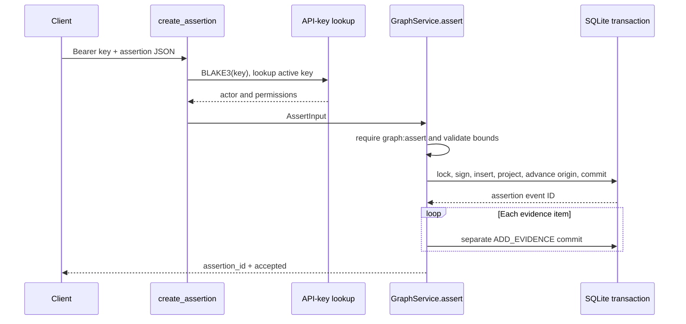

# Local assertion commit

```mermaid
sequenceDiagram
    participant Client
    participant API as create_assertion
    participant Auth as API-key lookup
    participant Graph as GraphService.assert
    participant DB as SQLite transaction
    Client->>API: Bearer key + assertion JSON
    API->>Auth: BLAKE3(key), lookup active key
    Auth-->>API: actor and permissions
    API->>Graph: AssertInput
    Graph->>Graph: require graph:assert and validate bounds
    Graph->>DB: lock, sign, insert, project, advance origin, commit
    DB-->>Graph: assertion event ID
    loop Each evidence item
        Graph->>DB: separate ADD_EVIDENCE commit
    end
    Graph-->>Client: assertion_id + accepted
```

The diagram describes the inspected call path. It does not show remote
replication, and the evidence loop is only reached after the assertion commit
succeeds.
